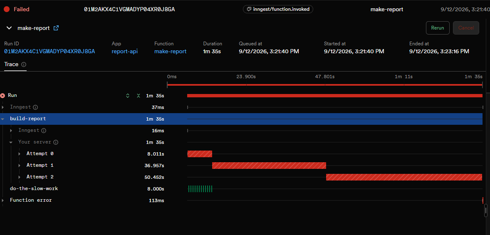
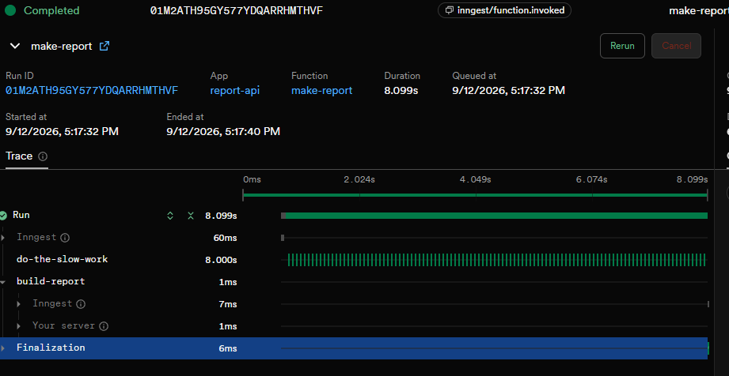

# Background Job — FlyRank Backend Track, W4, Assignment A7

## What this is

A small Express API with one deliberately slow task: generating a "report" that
takes 8 seconds. Instead of making the client wait, the endpoint accepts the
request instantly and hands the slow work to a background job powered by
[Inngest](https://www.inngest.com). A status endpoint lets the client poll for
completion, failed jobs are retried automatically (and marked `failed` once
retries are exhausted), and a cron job runs independently of any request to
report the current state of all reports every minute.

## How to run it

Two terminals, both from the project root:

```bash
# terminal 1 — the API
npm install
INNGEST_DEV=1 node server.js

# terminal 2 — the Inngest Dev Server + dashboard
npx inngest-cli@latest dev -u http://localhost:3000/api/inngest
```

Dashboard: [http://localhost:8288](http://localhost:8288)

`INNGEST_DEV=1` tells the SDK you're running locally, so it doesn't warn about
a missing production signing key.

## Endpoints & functions

| Type | Name | Purpose |
|---|---|---|
| GET | `/health` | Liveness check — returns `{ status: "ok" }` |
| POST | `/reports` | Accepts `{ topic }`, returns `202` + `{ id, status: "pending" }` instantly. Missing/empty `topic` → `400`, no job created. |
| GET | `/reports/:id` | Returns the stored report: `pending` → `done` (with result) or `failed` (with error). Unknown id → `404`. |
| Event function | `make-report` | Triggered by `report/requested`. Sleeps 8s (stand-in for slow work), then builds the report. `topic: "fail"` throws deliberately to demonstrate retries (`retries: 2`); `onFailure` marks the report `failed` once retries are exhausted. |
| Cron function | `heartbeat` | Triggered on schedule `* * * * *` (every minute). Logs a summary line of how many reports are `pending`, `done`, and `failed`. No endpoint, no event — the clock is the only trigger. |

## Proof — instant 202

```
$ time curl -i -X POST http://localhost:3000/reports -H "Content-Type: application/json" -d '{"topic":"cats"}'
HTTP/1.1 202 Accepted
Content-Type: application/json; charset=utf-8

{"id":"ef08f9fb-c277-41c7-8dc3-932689c7652f","status":"pending"}

real    0m0.227s
```

The endpoint answers in 227ms even though the underlying job takes 8 seconds —
the whole point of the pattern.

## Proof — status transition (pending → done)

```
$ curl -i -X GET http://localhost:3000/reports/10ae737f-45aa-4c28-90de-e46682b9fc89
HTTP/1.1 200 OK
{"id":"10ae737f-45aa-4c28-90de-e46682b9fc89","topic":"cats","status":"pending"}

# ~8 seconds later
$ curl -i -X GET http://localhost:3000/reports/10ae737f-45aa-4c28-90de-e46682b9fc89
HTTP/1.1 200 OK
{"id":"10ae737f-45aa-4c28-90de-e46682b9fc89","topic":"cats","status":"done","result":{"summary":"This is a report on cats"}}
```

## Stage 3 — validation vs. retry

A `400` for a missing `topic` is rejected at the door and never becomes a job,
because the input is deterministically broken — retrying it a hundred times
with backoff would produce the identical failure every time, wasting compute
and time for a guaranteed outcome. A job that fails with `topic: "fail"` is a
stand-in for a *transient* failure (a network blip, a momentarily unavailable
service) — the same input might genuinely succeed on a later attempt, which is
exactly what a retry is for.

## Stage 4 — cron

- Every day at 08:00: `0 8 * * *`
- Every Sunday at 22:00: `0 22 * * 0`

Cron schedules are usually evaluated in UTC by the server or scheduler running
them, not in the local timezone of whoever wrote the expression — so a
schedule that looks right on paper can fire at the wrong wall-clock time in
production unless the timezone is checked and pinned. Inngest supports a `TZ=`
prefix on the cron expression for exactly this reason, so the schedule can be
explicitly tied to a real timezone instead of assuming UTC.

## Dashboard screenshots

**Failed run — 3 attempts, backoff, ends Failed:**


**Heartbeat — two runs, one minute apart:**


**Completed run — successful make-report:**

