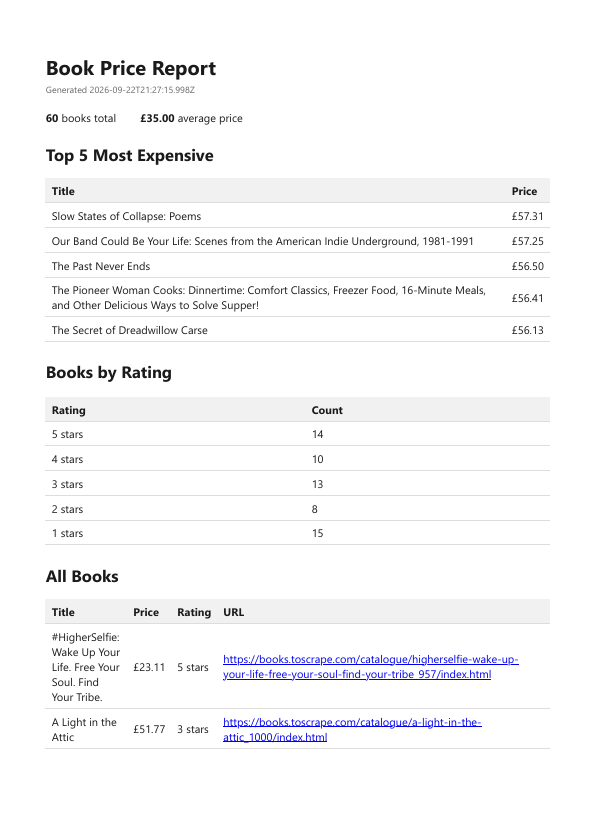

# PDF report generator

Queries a SQLite database of scraped book data, renders it into a multi-page A4 PDF, and serves that file by link from an Express API. The whole pipeline — query, render, store, serve — runs inside a plain endpoint.

FlyRank Internship · Backend Track · W4 · Assignment A8.

## Dataset

60 book records scraped from [books.toscrape.com](https://books.toscrape.com) in **A9 — The polite scraper** (`../Scraper/`). The seed script reads that scraper's validated `books.json` and loads it into `report.db`.

Each record: title, price (GBP), star rating (1–5), product URL. Star ratings arrive from the scraper as words (`"Three"`) and are mapped to integers at seed time.

## Stack

| Piece | Choice |
|---|---|
| Runtime | Node.js 24 |
| Web framework | Express |
| Database | SQLite via the built-in `node:sqlite` module |
| PDF rendering | Playwright (headless Chromium) |

No external services, no credentials, no accounts.

## Run it

```bash
npm install
npx playwright install chromium   # downloads Chromium, ~1 min
npm run seed                      # loads 60 books into report.db
npm start                         # http://localhost:3000
```

Start over from scratch (wipes `report.db` and `reports/`, then reseeds):

```bash
npm run reset
```

Stop the server before resetting — it holds `report.db` open.

The seed script is safe to run twice: it clears the table inside the same transaction as the inserts, so a second run leaves exactly 60 rows rather than 120.

## API

| Method | Path | Returns |
|---|---|---|
| `GET` | `/health` | `{ "status": "ok" }` |
| `POST` | `/reports` | `201` + id and file link on generation, `200` + the existing report if one already exists for today |
| `GET` | `/reports/:id` | the report record; `404` if the id is unknown |
| `GET` | `/reports/:id/file` | the PDF, served from disk |

`POST /reports` accepts `{ "force": true }` to generate a fresh report even when today's already exists.

Only `/reports/:id/file` moves the file's bytes. The JSON endpoints carry an id and a link — store and link, never pass the artifact around.

## Project layout

```
pdf-report-generator/
├── src/
│   ├── db.js          DatabaseSync instance + schema
│   ├── seed.js        wipe + load books.json
│   ├── queries.js     getReportData() — the aggregations
│   ├── template.js    buildHtml(report) — HTML + print CSS
│   ├── render.js      renderPdf(html, path) — Playwright
│   ├── reports.js     createReport() — claim, render, record
│   ├── reset.js       wipe report.db and reports/
│   └── server.js      Express routes
├── reports/           generated PDFs (gitignored)
├── report.db          SQLite database (gitignored)
└── docs/
    └── report-page-1.png
```

`reports/` and `report.db` are gitignored — generated artifacts and databases do not belong in Git. The seed script is their recipe. `render.js` creates `reports/` on demand, so a fresh clone works without the directory existing.

## Aggregation SQL

**Total number of books**

```sql
SELECT COUNT(*) AS total FROM books;
```

**Average price**

```sql
SELECT ROUND(AVG(price), 2) AS avgPrice FROM books;
```

**Top 5 most expensive books**

```sql
SELECT title, price
FROM books
ORDER BY price DESC, title ASC
LIMIT 5;
```

`title ASC` is a tiebreaker. Without it, two books at the same price make the fifth row arbitrary and the report stops being reproducible between runs.

**Books per star rating**

```sql
WITH scale(rating) AS (VALUES (1), (2), (3), (4), (5))
SELECT scale.rating    AS rating,
       COUNT(books.id) AS count
FROM scale
LEFT JOIN books ON books.rating = scale.rating
GROUP BY scale.rating
ORDER BY scale.rating DESC;
```

Two deliberate choices here:

- The CTE defines the full domain (every rating from 1 to 5) and the books are left-joined onto it. A plain `GROUP BY rating` only returns ratings that appear in the data, so a rating with no books would vanish from the report entirely — and a reader cannot tell "zero books at this rating" from "this rating was not measured".
- `COUNT(books.id)`, not `COUNT(*)`. For a rating with no matching book, the left join still emits one row with the book columns set to `NULL`. `COUNT(*)` counts that row and reports 1; `COUNT(books.id)` skips nulls and correctly reports 0.

**The long table** (drives the multi-page PDF)

```sql
SELECT title, price, rating FROM books ORDER BY title;
```

## Proof: generate and download

All of the following is one terminal session, starting from a clean database.

Clean slate:

```console
$ npm run reset

> pdf-report-generator@1.0.0 reset
> node src/reset.js && node src/seed.js

wiped report.db and reports/
seeded 60 books
(node:10508) ExperimentalWarning: SQLite is an experimental feature and might change at any time
(Use `node --trace-warnings ...` to show where the warning was created)

$ ls reports/
ls: cannot access 'reports/': No such file or directory
```

First request generates — note the wait while Chromium renders:

```console
$ time curl -i -X POST http://localhost:3000/reports
HTTP/1.1 201 Created
X-Powered-By: Express
Content-Type: application/json; charset=utf-8
Content-Length: 73
ETag: W/"49-OVJyGQOpyfaY3qF0MN+uWZp3mOQ"
Date: Tue, 22 Sep 2026 21:48:22 GMT
Connection: keep-alive
Keep-Alive: timeout=5

{"id":1,"created_at":"2026-09-22T21:48:21.624Z","file":"/reports/1/file"}

real    0m1.225s
user    0m0.031s
sys     0m0.015s
```

Second request, fired back-to-back with the first, returns the same id with `200` instead of `201` — and in milliseconds rather than seconds:

```console
$ time curl -i -X POST http://localhost:3000/reports
HTTP/1.1 200 OK
X-Powered-By: Express
Content-Type: application/json; charset=utf-8
Content-Length: 73
ETag: W/"49-OVJyGQOpyfaY3qF0MN+uWZp3mOQ"
Date: Tue, 22 Sep 2026 21:48:33 GMT
Connection: keep-alive
Keep-Alive: timeout=5

{"id":1,"created_at":"2026-09-22T21:48:21.624Z","file":"/reports/1/file"}

real    0m0.060s
user    0m0.000s
sys     0m0.015s
```

Two requests, one file:

```console
$ ls reports/
1.pdf
```

Forcing a fresh report gets a new id and a second file:

```console
$ curl -i -X POST -H 'content-type: application/json' -d '{"force":true}' http://localhost:3000/reports
HTTP/1.1 201 Created
X-Powered-By: Express
Content-Type: application/json; charset=utf-8
Content-Length: 73
ETag: W/"49-goh8YHOcWdQWawE54BAvRv51re4"
Date: Tue, 22 Sep 2026 21:48:50 GMT
Connection: keep-alive
Keep-Alive: timeout=5

{"id":2,"created_at":"2026-09-22T21:48:49.585Z","file":"/reports/2/file"}

$ ls reports/
1.pdf
2.pdf
```

A normal request afterwards returns the forced report, not the earlier one:

```console
$ time curl -i -X POST http://localhost:3000/reports
HTTP/1.1 200 OK
X-Powered-By: Express
Content-Type: application/json; charset=utf-8
Content-Length: 73
ETag: W/"49-goh8YHOcWdQWawE54BAvRv51re4"
Date: Tue, 22 Sep 2026 21:49:01 GMT
Connection: keep-alive
Keep-Alive: timeout=5

{"id":2,"created_at":"2026-09-22T21:48:49.585Z","file":"/reports/2/file"}

real    0m0.058s
user    0m0.015s
sys     0m0.015s
```

Downloading the artifact:

```console
$ curl -o my-report.pdf http://localhost:3000/reports/2/file
```

Unknown id:

```console
$ curl -i http://localhost:3000/reports/9999
HTTP/1.1 404 Not Found
X-Powered-By: Express
Content-Type: application/json; charset=utf-8
Content-Length: 28
ETag: W/"1c-4Y30jL2fFC2dljlM0qcET2Z3RUo"
Date: Tue, 22 Sep 2026 21:49:14 GMT
Connection: keep-alive
Keep-Alive: timeout=5

{"error":"report not found"}
```

## Sample output



The long book table crosses a page break. Two print CSS rules keep it readable:

```css
thead { display: table-header-group; }  /* repeat the header on every page */
tr    { break-inside: avoid; }          /* never slice a row in half */
```

Playwright's `page.pdf()` switches Chromium into print emulation before rasterizing, so `@media print` rules apply and `@media screen` rules are silently dropped. `printBackground: true` is required or background colours are stripped, exactly as in a browser's print dialog.

## At what point would this work leave the request?

Once generation takes more than a second or two — a bigger dataset, or several users generating at the same time — holding an HTTP connection open for the whole render is the wrong shape. The client is held hostage, a dropped connection loses the result, and a deploy kills work that is in flight. At that point `POST /reports` should return `202` with an id immediately and hand the render to a background job, with the client polling `GET /reports/:id` until the status says the file is ready.

Measured here: **1.225 s** to generate, **0.060 s** for the cached path. The render is roughly twenty times the cost of everything else in the request, and it is the only part that grows with the data.

## What the duplicate check protects against

It protects against a duplicated *request* — a user double-clicking "Generate report", or an HTTP client retrying after a timeout — producing two identical artifacts from one intent. Without it, the same click would burn a second Chromium render and leave a second file on disk that nobody asked for.

The classic place this costs real money is checkout: a double-clicked "Pay" button that charges the customer twice, which is why payment APIs such as Stripe require an idempotency key on every request rather than trusting the client to click once.

## What I'd change in production

I would move the duplicate check from a server-side rule to a client-supplied **idempotency key**. The `force` flag exists only because the server has to guess what the user meant — one request per day is the server's assumption, not the user's intent. With an idempotency key the client declares that intent directly: a retry carries the same key and returns the original response, and a deliberate regeneration carries a new key and produces a new report. No flag, no once-per-day rule, and no ambiguity about which report a repeated request should return.

## Known limitations

- **The report date is UTC.** `new Date().toISOString().slice(0, 10)` means "today" rolls over at 00:00 UTC, not local midnight. Deliberate, but worth naming.
- **A crash mid-render leaves an orphan row.** The row is inserted before rendering starts, so an interrupted render leaves a row whose `path` stays `NULL` forever. `GET /reports/:id/file` returns 404 for it; nothing repairs it. A `status` column (`pending` / `done` / `failed`) plus a sweep on startup is the fix.
- **A request that loses the claim may get a report that is not rendered yet.** A second request arriving while the first is still rendering receives the correct id, but the file does not exist for another second or two.
- **`substr(report_date, 1, 10)` cannot use the index** on that column, so the lookup is a full scan. Irrelevant at this row count; a wrong default at scale.
